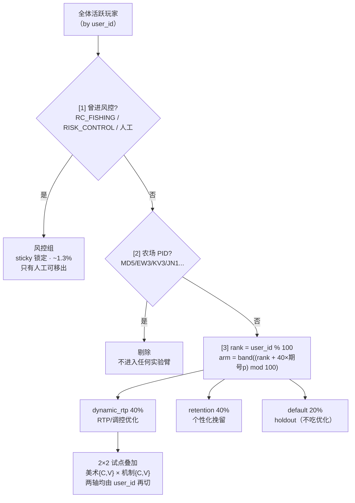
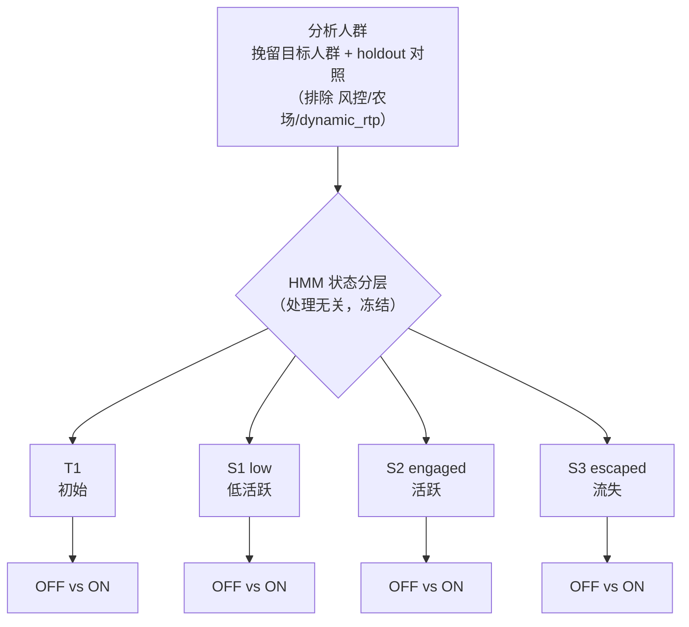
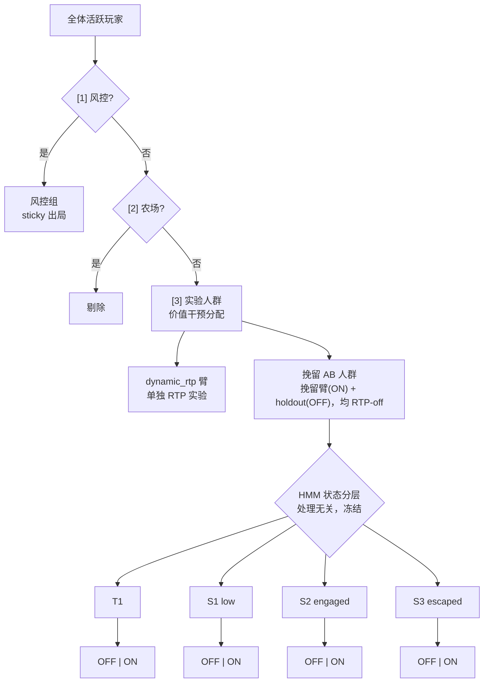

# FM01 AB 实验 · 人群划分方案设计 v0.1

> 配套 PRD：`2026-08-11 A-B 实验平台 PRD v0.2.html`
> 适用游戏：FM01（捕鱼大师）· 数据表：`transform-agfish-game.public.bullet`
> 起草：2026-08-13 · 状态：draft（人群划分部分已实测验证；2×2 叠加待确认）

---

## 0. 已确认的设计决策（本轮拍板）

| 决策点 | 结论 |
|---|---|
| 试点游戏 | FM01 捕鱼 |
| 分流哈希 | 复用 `user_id`（不引入设备/OneID，对齐 PRD §9.3） |
| 农场处理 | 分组前**剔除出实验人群** |
| 机制层变量 | RTP/调控参数调整 |
| 分组架构 | 风控优先 sticky + 其余按 `user_id` 切 **dynamic_rtp 40% / retention 40% / default 20%** |
| 每期换人 | **整个 40/40/20 每期重洗**，且**硬排除上期参与者**（同臂不连任） |

---

## 1. 分组优先级与口径

对每个 user（user 级判定，非记录级）：

**优先级 1 — 风控（sticky，最高）**
- 只要该 user **曾经**出现 `RC_FISHING*` / `%RISK_CONTROL%` 记录，或被人工强制拉入 → 永久归风控。
- **一旦进风控即锁定**，分组策略不再把 TA 分入其它组；只有**人工修改**才能移出。
- 风控可**强制**把任意组玩家拉入风控。
- 风控不参与下述尾号轮换。

**优先级 2 — 农场剔除**
- 已识别套利农场 PID（`MD5/EW3/KV3/JN1/C81/HL2/C16/JR8` 及其关联小号）从实验人群剔除，
  不进入任何 AB 臂，避免污染组间 RTP/盈亏对比。农场识别口径见套利分析报告。

**优先级 3 — 其余 user 按 rank 轮换分组**（详见 §2）

---

## 2. 每期轮换分组（旋转偏移方案）

```
rank = user_id % 100                       # 0-99，均匀哈希，终身稳定
p    = 期号（wave_id，从 0 递增）
arm  = band( (rank + 40 * p) mod 100 )
band: [0,40) -> dynamic_rtp   (40%)
      [40,80) -> retention    (40%)
      [80,100) -> default     (20%)   # 干净 holdout
```

**性质（已实测验证，见 §4）：**
1. 每期严格 40/40/20。
2. `STEP=40` → **相邻期同一臂人群完全 disjoint**（硬排除上期参与者，转移矩阵对角线=0）。
3. 每 5 期一个完整循环；长期看每个 user 轮遍三臂，覆盖公平。
4. 完全确定性、可复算，无需维护"已用名单"。

**"一期"的定义（参数，待定）**：建议对齐单个实验的 `minimum_duration`（如固定 2 周一期），
每开启新一期 `p += 1`。具体周期长度由实验审批确定。

---

## 2.1 分组方案图（Mermaid）



> 每期 `p+1`，全员按 `+40` 旋转重洗；上期在某臂的人本期一定换到别臂（硬排除，已实测对角线=0）。循环周期 5 期，每人轮遍三臂。

## 2.2 组别筛选逻辑（语义口径，不含 user_id 分配实现）

> 说明：随机分配的实现（user_id 哈希/轮换）作为工程实现细节单列，本节只定义各组的**筛选要求逻辑**。

| 组别 | 筛选要求（逻辑） | 优先级 / 性质 |
|---|---|---|
| 风控 risk_control | 命中风险信号（异常盈利 / 套利 / 多开 / 脚本射速）**或**人工判定 | 最高；sticky 锁定，只有人工可解除；可强制从任何组拉入 |
| 农场 farm（排除） | 命中已知农场 PID 或高倍狙击套利签名 | 剔除出实验，不进任何臂 |
| 个性化挽留 retention | 挽留系统目标人群（需要挽留干预的玩家） | 价值干预；挽留 AB 的实验人群 |
| dynamic_rtp | RTP 动态优化目标人群 | 价值干预；与挽留互斥，挽留 AB 排除 |
| default（holdout） | 不接受任何干预 | 绝对基准 / 对照来源 |

## 2.3 挽留策略 AB —— HMM 状态分层设计

**分层维度（HMM 模型产出，处理无关，两臂统一口径、分组时冻结）：**

| 状态 | 含义 |
|---|---|
| `T1` | 首日玩家（首次登录时间的第一个自然日） |
| `S1` | low —— 低活跃 / 低投入（模型定义分类） |
| `S2` | engaged —— 活跃投入（模型定义分类） |
| `S3` | escaped —— 流失 / 逃逸（模型定义分类） |

**处理臂：** Control（挽留 OFF / holdout） vs Variant（挽留策略 ON）。
**分析：** 每个 HMM 状态内独立比较 Variant vs Control 的 D1/D3/D7 留存、转化（ITT）。

**为何用 HMM 状态而非系统 `CR_FISHING:Tk` 标签：**
`Tk` 是挽留系统的**产出标签**，只有被处理的人才有；对照组没有 `Tk`，无法分层。
HMM 状态从**行为序列**算出、与是否被挽留无关，两臂都能算 → 消除 post-treatment 分层偏差。



## 2.4 整体 AB 玩家分割（整合 HMM 挽留 AB）

从全体玩家一路切到挽留 AB 的 HMM 终端格：



**终端组（共 11 个，挽留 AB = 第 4–11 的 8 格）：**

| # | 终端组 | 筛选逻辑（全链条 AND） |
|---|---|---|
| 1 | 风控组 | 命中风险信号 或 人工判定 → sticky |
| 2 | 农场（剔除） | 非风控 且 命中农场 PID/套利签名 |
| 3 | dynamic_rtp 臂 | 非风控 非农场 且 RTP 优化目标 |
| 4 | 挽留AB·T1·OFF | 实验人群 非dynamic 且 HMM=T1 且 holdout |
| 5 | 挽留AB·T1·ON | 实验人群 非dynamic 且 HMM=T1 且 挽留on |
| 6 | 挽留AB·S1·OFF | HMM=S1(low) 且 holdout |
| 7 | 挽留AB·S1·ON | HMM=S1(low) 且 挽留on |
| 8 | 挽留AB·S2·OFF | HMM=S2(engaged) 且 holdout |
| 9 | 挽留AB·S2·ON | HMM=S2(engaged) 且 挽留on |
| 10 | 挽留AB·S3·OFF | HMM=S3(escaped) 且 holdout |
| 11 | 挽留AB·S3·ON | HMM=S3(escaped) 且 挽留on |

**口径要点：**
- 对照组 OFF 来自 holdout，与挽留臂 ON **均不吃 RTP** → 两臂唯一差异 = 挽留 ON/OFF，主效应无混淆。
- dynamic_rtp 臂吃 RTP，会混淆挽留效果，**排除**在挽留 AB 之外。
- 每个 HMM 状态内比 ON vs OFF（D1/D3/D7 留存、转化，ITT）。

## 3. 与 A/B 实验平台的对应

这套 40/40/20 本质是**常驻 holdout 三臂设计**：

| 臂 | 含义 | 在 PRD 中的角色 |
|---|---|---|
| dynamic_rtp 40% | 吃 RTP/调控优化 | player_value_intervention 处理组 |
| retention 40% | 吃个性化挽留 | 另一 value intervention 处理组 |
| default 20% | 不吃任何优化 | 全局 holdout / 绝对基准 |

### 3.1 受控 2×2 试点叠加（**待确认**）
PRD §5.11 的旗舰 2×2 = 美术素材 × RTP/调控机制。拟叠加方式：
- **机制层（player_value_intervention）**：在 `dynamic_rtp` 40% 臂**内部**再切
  control（现行 RTP）vs variant（新 RTP 参数）；`default` 20% 作绝对基准 holdout。
- **美术层（art_presentation）**：用**第二个正交哈希**（如 `(user_id / 10) % 2` 十位奇偶）
  做 50/50，与 rank 独立 → 干净 2×2 四单元。
- 四单元：art{C,V} × mechanism{C,V}，联合 SRM 检查（PRD §5.6）。

> ⚠ 待你确认：机制 control/variant 是"在 dynamic_rtp 内部切"，还是"新机制 vs 现行 dynamic_rtp 整体对比"。

---

## 4. 验证记录（2026-08-13）

- 全体 distinct 用户 22,022；风控 sticky 287（1.3%）；非风控 21,756。
- 静态 40/40/20 实测：dynamic 39.2% / retention 39.9% / default 19.6%。
- 非风控尾号均匀性：每尾号 9.74%–10.25%（SRM 基线稳）。
- 旋转轮换 W0–W3：每期 40/40/20；相邻期臂转移矩阵**对角线全 0**（硬排除成立）。
- 验证脚本：`jobs/ab_testing/ab_grouping_verify.py`（static / rotate 子命令）。

---

## 5. 已知代价与开放问题

**代价（已知情接受）：**
- 每期重洗 → 破坏 cohort continuity：无法在同一批人上累积 D7/D30 留存、LTV
  （纵向长期测量需稳定 cohort / 长期 holdout，属 PRD Phase 2）。
- 历史挽留组（旧口径尾号 0/1）cohort 在新轮换下不再连续。

**开放问题：**
| 编号 | 问题 |
|---|---|
| OQ-A1 | "一期"周期长度（2 周？对齐 minimum_duration？） |
| OQ-A2 | 2×2 机制 control/variant 的切法（§3.1 待确认项） |
| OQ-A3 | 农场识别是否需要每期动态更新（新马甲不断出现） |
| OQ-A4 | 风控 sticky 是否设"冷静期/复评"（长期只增不减会否越滚越大） |
| OQ-A5 | 是否需要一个永不参与轮换的稳定 holdout 以支持纵向测量 |
