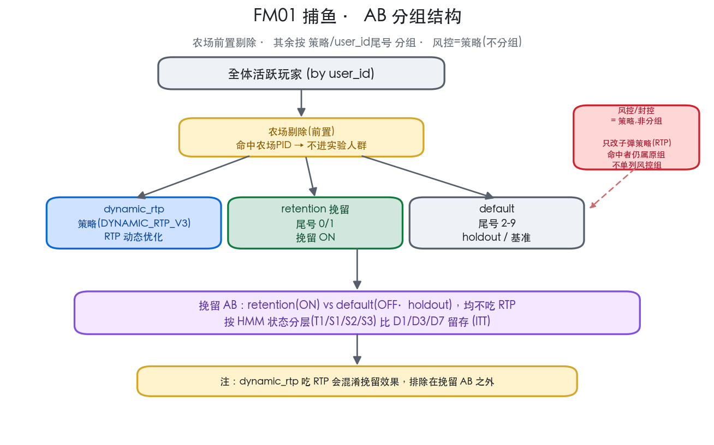
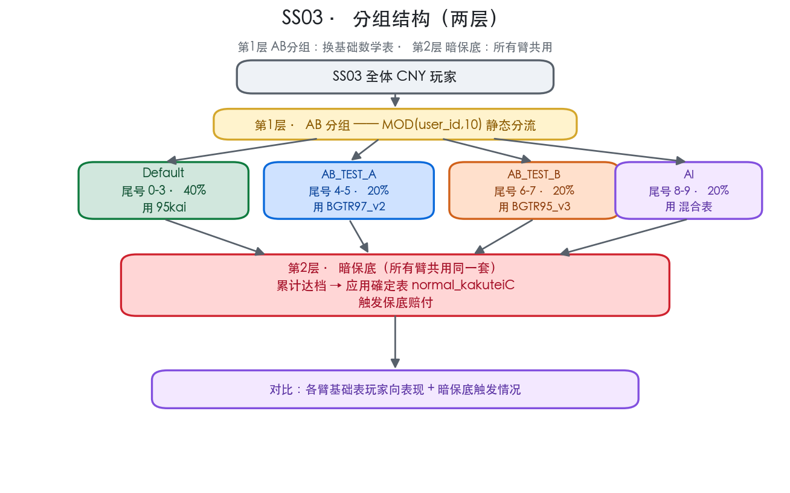
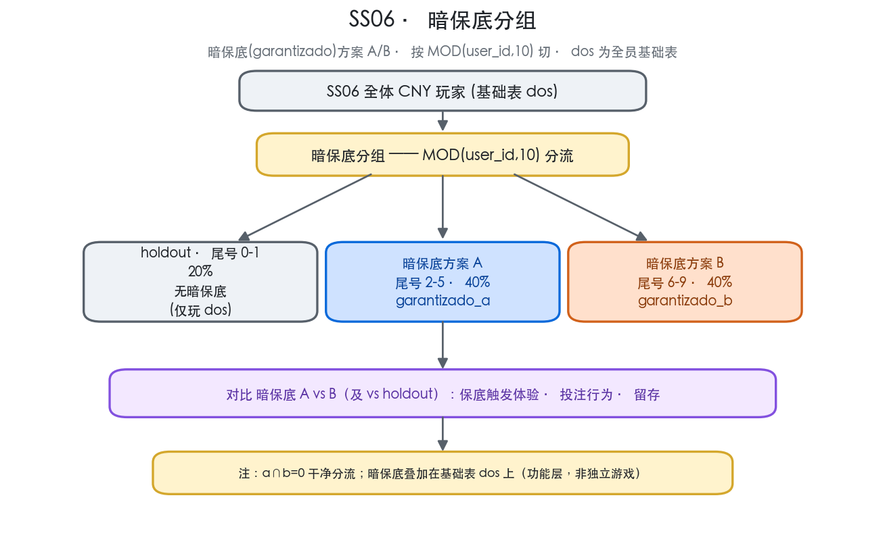
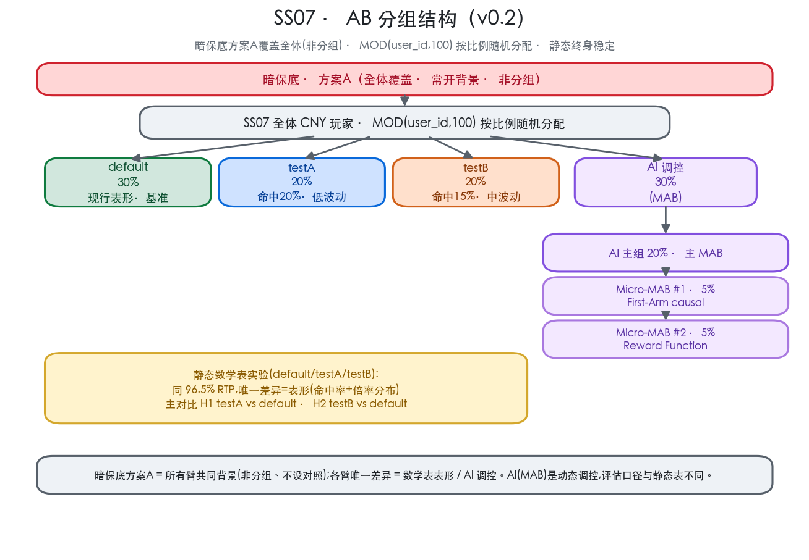
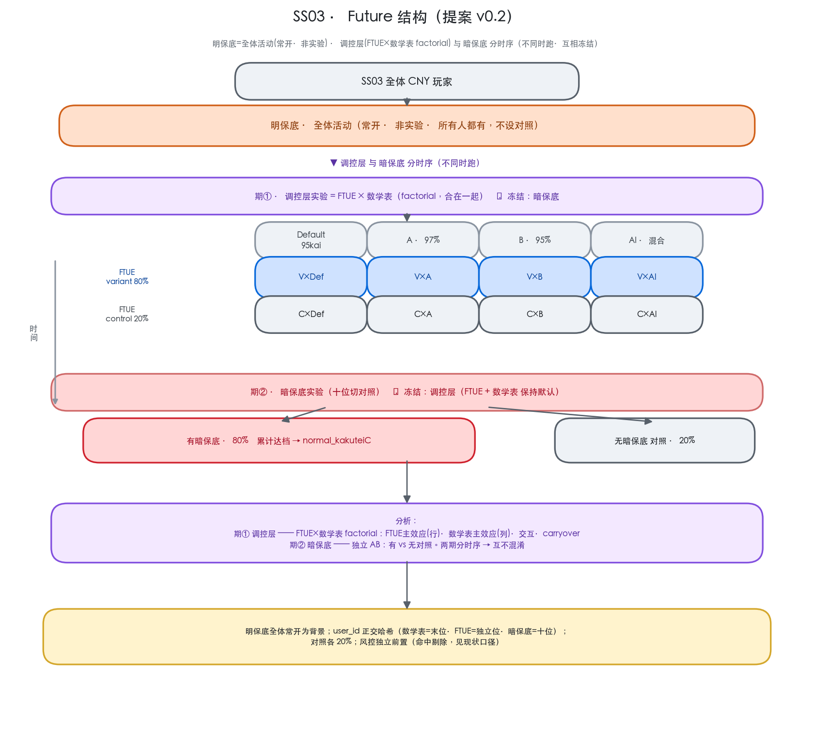
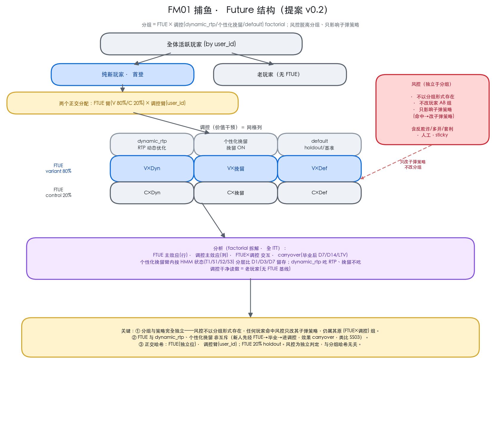

# AB 分组规格汇总 · v0.1

> 覆盖游戏：FM01 捕鱼 · SS03 · SS06 · SS07 · 空间 `slot-machine` / `transform-agfish-game`
> 汇总日：2026-08-24 · 状态：draft（SS03/SS06 为线上现状实测；SS07 为方案 v0.1 尚未上线）
> 各游戏详情：FM01 见 `AB分组方案设计_v0.1.md`；SS07 见 `SS07_数学表AB方案_v0.1.md`；SS03 见 `docs/SS03_分组政策.md`

---

## 0. 总览对照

| 游戏 | 状态 | 分流机制 | 臂（占比） | 实验对象 | 主指标 |
|---|---|---|---|---|---|
| **FM01 捕鱼** | 线上 | 风控/农场 sticky 剔除 + 策略/尾号 | 风控 · dynamic_rtp · retention(尾0/1) · default(尾2-9) | 个性化挽留 ON/OFF | D1/D3/D7 留存(HMM 分层) |
| **SS03** | 线上 | **两层**：AB分组 MOD10 + 暗保底(共用) | 第1层 Default(95kai) · A(BGTR97_v2) · B(BGTR95_v3) · AI(混合)；第2层 暗保底三档→kakuteiC | 数学表表形 + 暗保底 | RTP · 留存 · 投注 |
| **SS06** | 线上 | `MOD(user_id,10)`（暗保底分组） | holdout 0-1(20%) · 暗保底方案A 2-5(40%) · 暗保底方案B 6-9(40%) | 暗保底方案 A/B | 保底体验 · 投注 · 留存 |
| **SS07** | 方案 v0.2 | **暗保底(方案A全体) + `MOD(user_id,100)` 按比例随机** | default(30%) · testA(20%) · testB(20%) · AI 调控(30%：主 MAB 20% + Micro-MAB#1 5% + Micro-MAB#2 5%) | 数学表表形(同 96.5% RTP) + AI(MAB)调控 | 人均投注额(缩尾+中位) |

**共性**：均以 `user_id` 尾号做确定性静态哈希（终身稳定、可复算、不引设备/OneID）；分析用 ITT 人群；投注类指标一律缩尾均值 + 中位数双口径（规避鲸鱼偏斜）；上线后先查 SRM。
**差异**：FM01 是「有无干预（挽留 ON/OFF）」的价值干预实验，且带风控/农场 sticky 剔除；SS03/SS06/SS07 是「换数学表/换功能方案」的机制实验，静态分臂、保 cohort 连续。

---

## 1. FM01 捕鱼



- **优先级（记录级判定，从高到低）**：① 风控管理 sticky（反欺诈/多开/套利统一归入风控，人工可拉入、锁定，剔除出局）→ ② 其余进实验人群。
- **实验臂**：
  - `dynamic_rtp` —— `strategy_name = DYNAMIC_RTP_V3`，RTP 动态优化。
  - `retention 挽留` —— 尾号 0/1 且上线（≥2026-07-31 UTC）后，个性化挽留 ON。
  - `default` —— 尾号 2-9，holdout / 基准，不吃挽留。
- **挽留 AB 分析**：retention(ON) vs default(OFF·holdout)，两臂均不吃 RTP → 唯一差异 = 挽留 ON/OFF；按 **HMM 状态**（T1 / S1 low / S2 engaged / S3 escaped，处理无关、冻结）分层比 D1/D3/D7 留存（ITT）。
- **口径**：`jobs/fishing/fm01_grouping.py`（GROUP_CASE / BASE_FILTER / RETENTION_LAUNCH_UTC）。
- **注**：dynamic_rtp 吃 RTP 会混淆挽留效果，排除在挽留 AB 之外。

---

## 2. SS03（两层结构）



SS03 是**两层**设计：第 1 层 AB 分组决定基础数学表；第 2 层暗保底为**所有臂共用**，累计到档触发確定表保底赔付。

### 2.1 第 1 层 · AB 分组（尾号 MOD10）→ 基础表

- **切换点**：2026-08-03 23:00 UTC（= 08-03 16:00 PDT）。此后按 `MOD(user_id,10)` 静态四臂；此前按注单 `partition_ab[0]` 映射。
- **四臂 + 各臂当前基础表（近 7 天实测）**：

| 臂 | 尾号 | 占比 | 基础数学表 | RTP |
|---|---|---|---|---|
| Default | 0-3 | 40% | `normal_zero_95_kai` | 95% |
| AB_TEST_A | 4-5 | 20% | `normal_Zero_BGTR97_Saitekika_BGadj_v2` | 97% |
| AB_TEST_B | 6-7 | 20% | `normal_Zero_BGTR95_Saitekika_BGadj_v3` | 95% |
| AI | 8-9 | 20% | 混合（95kai / v3 / normal_ni） | 95%~ |

> ⚠ 更正：Default 跑的是 95kai（不是中性基准）；AB_TEST_B 跑的是 **BGTR95_v3（95%）**（早前误记为 BG97/97%）。08-18 18:00 PDT 换表后现状即上表；切换前按 partition_ab 映射，同一玩家同天可能跨组。

### 2.2 第 2 层 · 暗保底（所有臂共用）→ `normal_kakuteiC`

- **所有臂共用同一套暗保底**：玩家累计达档后，切確定表 `normal_kakuteiC` 触发保底赔付（近 7 天 2,582 人触发，覆盖全部 4 臂）。
- 具体门槛/档位参数见暗保底定稿文档，此处不展开。

### 2.3 对比口径

- 第 1 层：各臂基础表玩家向表现 —— RTP · 人均净亏 · D1/D3/D7 留存 · 投注行为（缩尾均值 + 中位）。
- 第 2 层：暗保底触发情况。
- **口径**：`jobs/ss03_analysis/ss03_grouping.py`；政策 `docs/SS03_分组政策.md`。

---

## 3. SS06（暗保底分组）



- **结构**：`dos` 为全员基础表；**暗保底（garantizado）分组**做 A/B，按 `MOD(user_id,10)` 切。暗保底叠加在基础表之上（功能层，非独立游戏）。
- **臂**：
  - `holdout` 尾号 0-1（20%）—— 无暗保底，仅玩 dos。
  - `暗保底方案 A`（`garantizado_a`）尾号 2-5（40%）。
  - `暗保底方案 B`（`garantizado_b`）尾号 6-9（40%）。
- **对比**：暗保底 A vs B（及 vs holdout）—— 保底触发体验 · 投注行为 · 留存。
- **实测验证（近全期 CNY）**：a∩b = 0（干净分流）；暗保底用户同时也玩基础表 dos。方案A 630 人、方案B 380 人（2026-07-08 起）。
- **注**：SS06 日 DAU ~150，样本偏小；A/B 判定需较长周期累积。

---

## 4. SS07（方案 v0.2，尚未上线）



- **目的**：同 RTP 96.5% 下，测 payout 分布 + 命中率（表形）对投注行为与留存的影响（剥离 RTP 变量）；同时用 AI 组在线试验 MAB 调控新方向。
- **分流机制**：`MOD(user_id,100)` **按比例随机分配**（不手工指定尾号桶；终身稳定、可复算）。
- **臂**（占比）：
  - `default`（30%）—— 现行表形 / 基准。
  - `testA`（20%）—— 命中 20% · 低波动 · 小奖密集（加 1-5x、砍 50-100x）。
  - `testB`（20%）—— 命中 15% · 中波动 · 中奖为主（加 2-10x、砍 20-100x）。
  - `AI 调控`（30%，MAB 动态）：**主组 20%（主 MAB）** + **Micro-MAB #1 · 5%（First-Arm causal）** + **Micro-MAB #2 · 5%（Reward Function）**。两个小组用于测 MAB 新方向。
- **暗保底层（方案 A · 全体覆盖 · 非分组）**：作为所有臂共同背景常开，不设对照。
- **主对比（ITT，静态表）**：H1 testA vs default · H2 testB vs default（H3 testA vs testB 次要）。AI(MAB)是动态调控，评估口径与静态表不同（看 MAB 收敛后 arm 表现，不做等价 ITT 均值对比）。
- **主指标**：人均投注额（缩尾 95% 均值 + 中位数，不用 log）；护栏各臂实测 RTP≈96.5%、实测命中率复现、D1/D3/D7 留存。
- **口径（上线后建）**：`jobs/ss07_analysis/ss07_grouping.py`（对齐 ss03）；详情 `SS07_数学表AB方案_v0.1.md`。

---

## 5. SS03 · Future 结构（提案 v0.2，未上线）

结构调整(v0.2):
- **明保底 = 全体活动**(常开、所有人都有)，**不是 AB 实验**，无对照组。
- **调控层(FTUE × 数学表)保持 factorial 合在一起**;**调控层 与 暗保底 分时序**(不同时跑、互相冻结) → 两块互不混淆。
  - 跑**调控层**(FTUE×数学表)时：暗保底冻结在默认;
  - 跑**暗保底**时：调控层(FTUE、数学表)冻结在默认。



### 5.0 分流总览（两块分时序）

| 块 | 何时跑 | 内容 | 哈希位 |
|---|---|---|---|
| **调控层实验** | 调控层期 | FTUE(V80%/C20%) **×** 数学表(Default/A/B/AI) factorial | FTUE=独立位、数学表=末位 |
| **暗保底实验** | 暗保底期 | 有暗保底 80% / 无对照 20% | 十位 `MOD(user_id/10,10)` |
| 明保底 | —（常开） | **全体活动·非实验** | — |

> 调控层 与 暗保底 分时序、互相冻结 → 各块独立分析;明保底常开为背景。上线先查 SRM。

---

### 5.1 期① · 调控层实验（FTUE × 数学表 factorial）

FTUE 与数学表**合在一起**做 factorial(2×4 组合格),同一新人经历一个 (FTUE, 数学表) 组合;此期内暗保底冻结。

| 项 | 内容 |
|---|---|
| **目标** | 数学表(表形/RTP)、FTUE(新手引导) 各自及交互对玩家表现/留存的影响 |
| **人群** | 全体(数学表维度) + 首登新玩家(FTUE维度;老玩家=FTUE-none 基线) |
| **分流** | 数学表 `MOD(user_id,10)` 末位(Default 0-3/A 4-5/B 6-7/AI 8-9)；FTUE 独立正交哈希位(V 80%/C 20%) |
| **处理** | 数学表:Def=95kai/A=BGTR97_v2/B=BGTR95_v3/AI=混合；FTUE:variant=FTUE表替代 / control=现状 |
| **冻结** | 该期内 **暗保底保持默认，不做变动** |
| **主指标** | RTP·净亏·D1/D3/D7 留存·投注(缩尾+中位);FTUE 另看早期留存/完成率 + carryover |
| **分析** | FTUE×数学表 factorial:FTUE 主效应(行)·数学表主效应(列)·交互(格间差)·carryover;数学表干净读数用老玩家 |
| **样本/时长** | 数学表 UV~12k/2周;FTUE 新玩家≈666/天→2周~9,300(V~7,440/C~1,860) |

### 5.2 期② · 暗保底实验（独立 AB）

| 项 | 内容 |
|---|---|
| **目标** | 暗保底(隐性累计保底)对留存 / 投注 / RTP 的净效果 |
| **人群** | 全体 |
| **分流** | 十位 `MOD(user_id/10,10)`：有暗保底 80% / 无对照 20% |
| **处理 vs 对照** | 有 = 累计达档触发確定表 `normal_kakuteiC` 保底赔付；无 = 不触发 |
| **冻结** | 该期内 **调控层(FTUE + 数学表)保持默认，不做变动** |
| **主指标** | RTP · 净亏 · 留存 · 投注（缩尾+中位）；暗保底触发率 / 成本 |
| **分析** | 有 vs 无对照（干净独立 AB）；对照 20% ≈ 2,400/2周，够测 20% 差异 |

### 5.3 明保底（全体活动 · 非实验）

- 面向**全体的常开活动**，所有人都有、**不设对照、不做 AB**;两期实验都常开作共同背景,分析时视为恒定环境。

### 5.4 口径

- **调控层内部 = factorial**(FTUE×数学表 同时跑、拆主效应+交互);**调控层 与 暗保底 = 分时序**(互相冻结、不混淆)。
- 各维用 `user_id` 正交哈希(数学表=末位·FTUE=独立位·暗保底=十位);风控独立前置(命中剔除)。
- 对照统一 **20%**(SS03 鲸鱼偏斜大,缩尾95%+中位,每组 ~1,300 测 20% 差异,20%~2,400 足够)。
- 指标：RTP · 净亏 · D1/D3/D7（及 D14/LTV）留存 · 投注（缩尾+中位）；全 ITT；上线查 SRM。

---

## 6. FM01 捕鱼 · Future 结构（提案 v0.2，未上线）

要点：**① 分组 = FTUE × 调控（dynamic_rtp/个性化挽留/default）factorial**（非互斥，效果类比 SS03）；**② 风控脱离分组**——分组与策略完全独立，风控**不以分组形式存在**、不改玩家 AB 组，**只影响子弹策略**（命中风控只改其子弹策略，仍属其原 FTUE×调控 组）。FM01 无暗/明保底（老虎机机制），调控层为价值干预。



### 6.0 分流总览（分组 = 两维正交哈希；风控独立于分组）

| 维度 | 实验/角色 | 判定/哈希 | 分组 |
|---|---|---|---|
| FTUE | 新玩家引导 | 独立哈希位（与调控臂正交） | variant 80% / control 20%（仅新玩家·窗口内） |
| 调控 | dynamic_rtp / 个性化挽留 / default | `user_id`（沿用 AB 口径） | dynamic_rtp / 挽留 / default（holdout） |
| ~~风控~~ | **不参与分组** | 风控独立判定（与分组哈希无关） | **不产生组，只改子弹策略**（见 §6.4） |

> FTUE × 调控 = 2×3 组合（V/C × dynamic_rtp/挽留/default）；老玩家 = 无 FTUE 基线行。全 ITT；上线查 SRM。

### 6.1 实验 A · FTUE 新玩家引导

| 项 | 内容 |
|---|---|
| **目标/假设** | FTUE 新手引导是否提升新玩家早期留存/转化/LTV（效果类比 SS03） |
| **人群** | **首登纯新玩家**（老玩家不参与，作 FTUE-none 基线） |
| **分流** | 与调控臂正交的独立哈希位；**variant 80% / control 20%** |
| **处理 vs 对照** | variant=FTUE 策略；control=现状新手体验 |
| **生效窗口** | 首登→毕业（须短：首会话/首日/首 N 笔）；毕业后进调控池 |
| **非互斥** | 毕业后仍经历 dynamic_rtp/挽留 → FTUE 效果 carryover |
| **主指标** | 窗口内早期留存/转化；毕业后 carryover D7/D14/LTV |
| **分析** | variant vs control（跨调控列 pool）；FTUE × 调控 交互 |
| **样本/时长** | 新玩家 ≈ 1,072/天 → 2 周 ≈ 15,000（variant ~12,000 / control ~3,000）；主效应 2 周，交互探索 |

### 6.2 实验 B · dynamic_rtp（调控 · RTP 优化）

| 项 | 内容 |
|---|---|
| **目标** | RTP 动态优化对玩家表现的影响 |
| **人群** | 全体玩家（调控臂之一） |
| **分流** | `user_id`（调控臂，沿用 AB 口径） |
| **处理** | RTP 动态优化 ON（`strategy_name=DYNAMIC_RTP_V3`） |
| **主指标** | RTP · 净亏 · 留存 · 投注（缩尾+中位） |
| **分析** | vs default holdout；FTUE × dynamic_rtp 交互；**吃 RTP，故排除在挽留 AB 之外** |

### 6.3 实验 C · 个性化挽留（调控 · HMM 分层）

| 项 | 内容 |
|---|---|
| **目标/假设** | 挽留策略 ON vs OFF 对 D1/D3/D7 留存的影响 |
| **人群** | 全体玩家（调控臂之一） |
| **分流** | `user_id`（调控臂） |
| **处理 vs 对照** | 挽留 ON vs default(OFF·holdout)，**两臂均不吃 RTP** → 唯一差异=挽留 ON/OFF |
| **分层** | HMM 状态 T1/S1(low)/S2(engaged)/S3(escaped)，处理无关、分组时冻结 |
| **主指标** | 各 HMM 状态内 D1/D3/D7 当日回访留存（ITT） |
| **分析** | 各 HMM 状态内 ON vs OFF；dynamic_rtp 吃 RTP，排除在挽留对比外 |

### 6.4 风控（脱离分组 · 只影响子弹策略 · 非实验）

- **分组与策略完全独立**：风控**不以分组形式存在**、不产生 AB 组、不改玩家的 (FTUE×调控) 组。
- 风控独立判定（反欺诈/多开/套利或人工，sticky），命中后**只改该玩家的子弹策略**（如加强风控子弹逻辑），但其在 §6.0 里的 FTUE/调控 分组**保持不变**。
- 与分组哈希无关，是**正交的策略层**；分析各分组实验时把风控视为策略侧扰动（可作协变量/诊断，不作分组维度）。

### 6.5 联合分析与口径

- **分组与策略独立**：风控只改子弹策略、不改分组；各分组实验按其 FTUE×调控 组分析，风控作策略侧扰动（诊断/协变量）。
- **factorial 拆解**：FTUE 主效应(行) · 调控主效应(列) · FTUE×调控 交互 · carryover(毕业后)。
- **挽留 HMM 分层**：在挽留臂内按 T1/S1/S2/S3 分层比留存；dynamic_rtp 吃 RTP 会混淆挽留效果，排除在挽留 AB 外。
- **干净读数**：调控 AB 主读数用老玩家（无 FTUE）；新玩家 cohort 带 FTUE block。
- 指标：RTP · 净亏 · D1/D3/D7（及 D14/LTV）留存 · 投注（缩尾+中位）；全 ITT；上线查 SRM。

---

## 7. group_name 编码定义与要求

### 7.1 定义

`group_name` = **数组**，每个元素表示该玩家参与的一个 AB 实验，形如 **`experiment=group`**（key=value，全英文）；每个 group 值都对应一个**数字编码**，故可等价表示为**文字数组**或**数字数组**。整份带一个**整体版本号**。

```
文字: [ "<experiment>=<group>", ... ]        数字: [ <n>, ... ]        version: v<N>
```

> 数字数组按固定实验顺序与文字数组一一对应。等价对象数组：`[{ "ab":"<experiment>", "group":"<group>", "code":<n> }, ...]`。

### 7.2 各游戏 实验名 + 组别（文字 = 数字）

| 游戏 | 实验名（key） | 组别（value = 编码） |
|---|---|---|
| SS03 | `math_table` | `default`=0 / `TestA`=1 / `TestB`=2 / `AI`=3 |
| SS03 | `ftue` | `variant`=0 / `control`=1 |
| SS03 | `dark_guarantee` | `on`=0 / `off`=1 |
| FM01 | `ftue` | `variant`=0 / `control`=1 |
| FM01 | `strategy` | `default`=0 / `dynamic_rtp`=1 / `customized_retention`=2 |
| SS06 | `dark_guarantee` | `default`=0 / `TestA`=1 / `TestB`=2 |
| SS07 | `math_table` | `default`=0 / `TestA`=1 / `TestB`=2 / `AI`=3 |
| SS07 | `ai_arm`（仅 AI 臂内） | `main`=0 / `micro1_firstarm`=1 / `micro2_reward`=2 |
| SS07 | `dark_guarantee` | `TestA`=0（全体覆盖·非分组·常开背景） |

> 编码 = 该实验组别的固定枚举序（从 0 起）；`default`/`variant`/`on`/`main` 均为 0。
> SS07 的 `dark_guarantee=TestA` 对全体常开（非分组）；`ai_arm` 仅当 `math_table=AI` 时附加。

### 7.3 示例

```
SS03 新玩家（default表·variant·暗保底on），实验顺序 [math_table, ftue, dark_guarantee]:
  文字: ["math_table=default", "ftue=variant", "dark_guarantee=on"]
  数字: [0, 0, 0]

SS03 老玩家（TestA表·暗保底off，无 ftue）:
  文字: ["math_table=TestA", "dark_guarantee=off"]     数字: [1, 1]

FM01（variant·customized_retention）:
  文字: ["ftue=variant", "strategy=customized_retention"]     数字: [0, 2]

SS06:  ["dark_guarantee=TestA"] = [1]

SS07 静态表臂（testB · 暗保底方案A全体常开）:
  文字: ["math_table=TestB", "dark_guarantee=TestA"]     数字: [2, 0]
SS07 AI 臂内 Micro-MAB #1（First-Arm causal）:
  文字: ["math_table=AI", "ai_arm=micro1_firstarm", "dark_guarantee=TestA"]     数字: [3, 1, 0]
```

### 7.4 要求

1. **数组**：一个玩家可同时在多个实验里，**每个实验一个元素**；实验顺序固定（数字数组按此顺序对齐）。
2. **key=value（全英文）**：key = AB 实验名（英文），value = 组别（英文），**并有对应数字编码**；可用文字数组或数字数组表示。
3. **版本**：整份带一个**整体 `v<N>`**，方案任一维度改动 → 整体 +1；各实验在该版本下的定义查 `ab_config`。
4. **只含"分组"实验**：
   - **风控不进 group_name**（脱离分组、只影响子弹策略，见 §6.4）；
   - **明保底不进**（全体活动、非实验，见 §5.3）。
5. **不参与/不适用则该元素不出现**（老玩家无 ftue 元素）；分时序被冻结的实验取其默认组别。
6. **确定性可复算**：由 user_id 各正交哈希位（math_table=末位·ftue=独立位·dark_guarantee=十位）+ 当期配置版本派生。

---

## 8. 开放问题

| 编号 | 游戏 | 问题 |
|---|---|---|
| Q1 | SS07 | 三表真实 `math_table_id`、default 表形参数（上线后填） |
| Q2 | SS07 | 真实流量复核样本量（现用 SS03 代理） |
| Q3 | SS06 | garantizado A/B 是否已出结论；DAU 偏小是否延长周期 |
| Q4 | SS03 | 切换前 partition_ab 的 A/B 映射待最终确认（A=4f1a46ca / B=4a04df21） |
| Q5 | FM01 | 每期是否重洗轮换（AB 方案 v0.1 提案 40/40/20 旋转，与现状静态尾号并存待定） |
| Q6 | 全部 | 是否需要跨游戏统一的常驻 holdout 支持纵向（LTV/D30）测量 |
| F-Q1 | SS03 Future | 调控层(FTUE×数学表) 与 暗保底 两块分时序的**排期**（各占多久、先后顺序） |
| F-Q2 | SS03 Future | 明保底作为全体活动的具体机制（常开形态、触发展示），需产品定稿 |
| F-Q3 | SS03 Future | 对照比例最终 20% 还是 10%（默认 20%，见 §5.5） |
| F-Q4 | SS03 Future | 分时序期间"冻结"的默认臂具体取哪个（如数学表冻结时全员用 Default？） |
| F-Q5 | SS03 Future | 正交哈希位（末位/十位/独立位）是否与既有系统冲突 |
| FT-Q1 | SS03 FTUE | 毕业条件的具体阈值（首会话/首日/首 N 笔/累计投注），待你定 |
| FT-Q2 | SS03 FTUE | FTUE 臂结构（FTUE-on vs 现状对照，还是多个 FTUE 变体） |
| FT-Q3 | SS03 FTUE | carryover 追踪的下游窗口与主指标（D7/D14/LTV 取谁为主） |
| FT-Q4 | SS03 FTUE | FTUE 用哪个正交哈希位（须与 MOD10/暗保底/明保底 的哈希位都不冲突） |
| FM-Q1 | FM01 Future | FTUE 毕业条件阈值 + FTUE 臂结构（同 SS03 待定） |
| FM-Q2 | FM01 Future | 调控臂（dynamic_rtp/挽留/default）流量比例（沿用现状尾号 or AB 提案 40/40/20 轮换） |
| FM-Q3 | FM01 Future | 风控命中后"改子弹策略"的具体逻辑（与分组独立），及是否作分析协变量 |
| FM-Q4 | FM01 Future | FTUE 与调控臂的正交哈希位分配（FTUE 独立位、调控用 user_id 尾号） |
