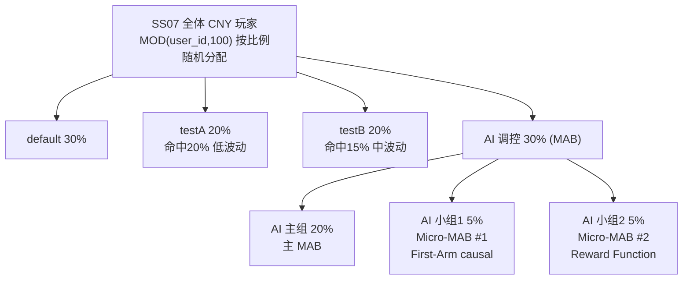
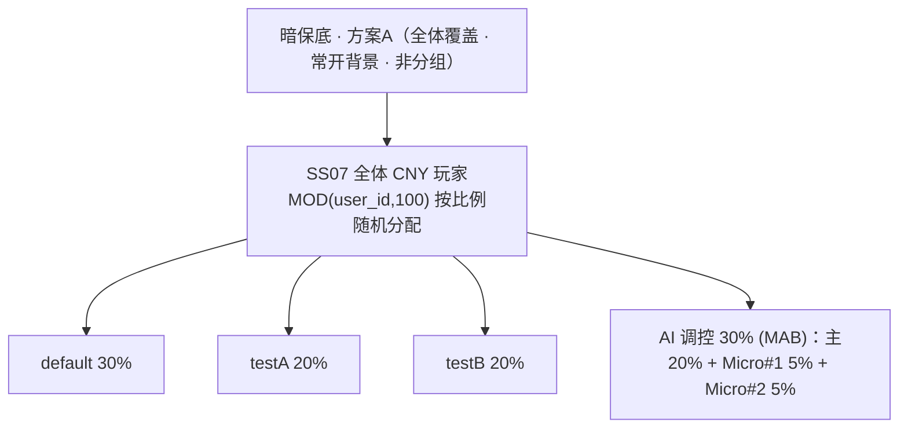

# SS07 数学表 A/B 实验 · 设计方案 v0.1

> 适用游戏：SS07（老虎机，新游戏，尚未上线）· 数据表（上线后）：`slot-machine.public.fct_bet_orders`
> 上位契约：`prd/ab_testing/2026-08-11 A-B 实验平台 PRD v0.2.html`
> 口径 skill：`.claude/skills/ab-experiment-design/SKILL.md`
> 起草：2026-08-21 · 更新：分流改为 MOD(user_id,100) 按比例随机分配、加入 AI 调控组(30%,含主20%+2个5%小组);比例 default30/testA20/testB20/AI30;另叠一层暗保底(全体·方案A·非分组) · 状态：draft（AI 30%=MAB:主MAB 20% + Micro-MAB#1/#2 各5%;各 MAB 机制待算法侧定稿,见 §7）

---

## 0. 已确认的设计决策

| 决策点 | 结论 |
|---|---|
| 试点游戏 | SS07（老虎机） |
| 实验目的 | 在**同 RTP（96.5%）**下，测 **payout 分布 + 命中率(hit rate)** 对投注行为与留存的影响 |
| 实验臂 | `default` / `testA` / `testB` / **`AI` 调控（内含 AI主组 + 2 个小分组）** |
| 分流哈希 | 复用 `user_id`，`MOD(user_id,100)`（每桶 1%），**按比例随机分配**，静态、终身稳定（不轮换、不引设备/OneID） |
| 分流比例 | **default 30% / testA 20% / testB 20% / AI 30%**；AI 内部 = AI主组 20% + 小组1 5% + 小组2 5% |
| 主指标 | **人均投注额**（缩尾均值 + 中位数双口径，**不用 log**） |
| 判定阈(MDE) | **相对差异 20%**（受 14 天周期约束，见 §5） |
| 实验周期 | **14 天一期** |
| 分析人群 | ITT（assignment 人群） |
| holdout | 无（三臂，default 即基准；如需常驻 holdout 见 §8 OQ） |

---

## 1. 假设（Hypothesis）

三张表 **RTP 全部 = 96.5%**，唯一差异是 **命中率 + payout 倍率分布（波动性表形）**。因此本实验剥离 RTP 变量，纯粹检验「表形」的影响。

| 表 | RTP | 命中率(payout>0) | 倍率分布调整 | 表形定性 |
|---|---|---|---|---|
| **default** | 96.5% | 现行 | 现行线上分布（基准） | 基准 |
| **testA** | 96.5% | **20%** | 加 2x/3x 符号；加 1–5x 占比；砍 50–100x | **高命中 · 低波动 · 小奖密集** |
| **testB** | 96.5% | **15%** | 加 3x/5x 符号；加 2–10x 占比；砍 20–100x | **中命中 · 中波动 · 中奖为主 · 砍大奖尾** |

**假设：**
- **H1（testA vs default）**：高命中低波动的表形，正反馈更密 → 提升投注频次/活跃天与人均投注额。
- **H2（testB vs default）**：中命中中波动、砍大奖尾的表形 → 影响人均投注额（可能提升单次投注），但高波动对低资金玩家留存有风险。
- **H3（testA vs testB，次要）**：命中率与波动结构差异对投注行为的净影响方向。

**预期方向（先验，待实测检验）**：testA 更可能拉高**投注次数/活跃天**（体验顺滑、正反馈多）；testB 更可能拉高**单次投注额**但**留存风险更高**。主指标（人均投注额）孰高需实验判定。

---

## 2. 实验臂与分流

### 2.1 分流规则（`MOD(user_id,100)` · 按比例随机分配 · 静态终身稳定）

**桶 = `MOD(user_id, 100)`**（0–99,共 100 个桶,user_id 尾两位近似均匀 → 每桶 ≈ 1% 流量）。**按各组比例把 100 个桶随机划给各组**;一旦划定,每人终身固定一臂、不随时间/会话变化。

| 组 | 占比 | 桶数(MOD100) | 角色 |
|---|---|---|---|
| **default** | 30% | 30 桶 | 对照基准（现行表形） |
| **testA** | 20% | 20 桶 | 处理臂（高命中低波动） |
| **testB** | 20% | 20 桶 | 处理臂（中命中中波动） |
| **AI 主组** | 20% | 20 桶 | AI 调控**主 MAB**（多臂老虎机动态调控·生产主线） |
| **AI 小组1** | 5% | 5 桶 | **Micro-MAB #1 · First-Arm causal**（MAB 新方向探索） |
| **AI 小组2** | 5% | 5 桶 | **Micro-MAB #2 · Reward Function**（MAB 新方向探索） |

> **随机分配**:桶→组的映射是按比例的一次性随机划分(工程/配置侧生成、固定一份);**不手工指定哪个尾号归哪组**。下方 SQL 的连续区间只是「一种等价的固定划分」示例,可换成配置里的实际随机划分。
> **为何 MOD100**:出现 5% 的 AI 小分组,MOD10(每档10%)切不出,需 MOD100(每桶1%)才能精确到 5%。
> **为何静态不轮换**:数学表实验需在同一批人上累积 D1/D3/D7 留存与投注行为,保 cohort 连续。

### 2.2 分组判定 SQL（上线后落 `jobs/ss07_analysis/ss07_grouping.py`）

```sql
-- 桶 = MOD(user_id,100),每桶 1%;以下为一种按比例的固定划分(实际以配置的随机划分为准)
CASE
  WHEN MOD(user_id,100) < 30 THEN 'default'    -- 30%
  WHEN MOD(user_id,100) < 50 THEN 'testA'      -- 20%
  WHEN MOD(user_id,100) < 70 THEN 'testB'      -- 20%
  WHEN MOD(user_id,100) < 90 THEN 'AI_main'    -- 20%（AI 主 MAB）
  WHEN MOD(user_id,100) < 95 THEN 'AI_sub1'    -- 5%（Micro-MAB #1 First-Arm causal）
  ELSE                            'AI_sub2'    -- 5%（Micro-MAB #2 Reward Function）
END AS arm
```

通用清洗（对齐 SS03 口径）：
```sql
game_id='SS07' AND currency_type='CNY' AND status='COMPLETED'
AND op_code NOT IN ('B26','TST','TSB','TSO')
```

### 2.3 分流图



### 2.4 AI 调控组（MAB）说明

AI 30% 用于 **MAB(多臂老虎机)动态调控**及其新方向探索,与 default/testA/testB 的「静态数学表」实验并列:

- **AI 主组 20%**:主 MAB —— 生产主线的多臂动态调控。
- **AI 小组1 5% · Micro-MAB #1 (First-Arm causal)**:测试「首臂因果」新方向的小流量探索组。
- **AI 小组2 5% · Micro-MAB #2 (Reward Function)**:测试「奖励函数」新方向的小流量探索组。

> 两个 Micro-MAB 各 5% 是**小流量探索臂**,与主 MAB 对照评估各自新方向的效果;具体机制(First-Arm causal 怎么改因果归因、Reward Function 换成什么奖励)待算法侧定稿(见 §7 OQ)。

### 2.5 暗保底层（全体覆盖 · 方案A · 非分组）

在上述 AB 分流之上叠加一层**暗保底**,**覆盖全体玩家、统一使用方案A**:

- 因为全体同一方案(方案A),暗保底**不构成分组维度、不设对照** → 是所有臂(default/testA/testB/AI)**共同的背景环境**(类似 SS03 的暗保底,但这里单方案全量、非实验)。
- 分析各 AB 臂时,**暗保底方案A 视为恒定背景**;各臂唯一差异仍是数学表表形 / AI 调控。
- 若日后要测暗保底本身,再切"无暗保底对照"(参考 SS03 Future 暗保底做法),届时它才成为一个实验维度。



---

## 3. 主指标 · 护栏 · 观测口径

**投注行为为主**；所有指标**都观测**，判定用缩尾均值 + 中位数双口径，**不用 log 变换**（保原单位可解释）。

| 层级 | 指标 | 口径 |
|---|---|---|
| **主判定** | 人均投注额 | 窗口内每人总投注额；报 **缩尾95%均值 + 中位数(Mann-Whitney)** |
| 主观测 | 人均投注次数 | 每人 bet 笔数；缩尾均值 + 中位 |
| 观测 | 人均活跃天 | 每人有投注的去重天数 |
| 观测 | 单笔投注额 | 每笔 bet_amount 中位 |
| 观测 | 会话时长 / 会话数 | （若有 session 表，映射 user_id） |
| **表形校验** | 实测命中率、命中间隔 | 验证 testA≈20% / testB≈15% 确实生效 |
| **护栏** | 实测 RTP | 三臂都须 ≈96.5%（否则 RTP 混淆，结论无效） |
| 护栏 | D1/D3/D7 留存 | day-N 当日回访率（当天有投注即活跃、按天算、不去重、北京日、右截断置空） |
| 护栏 | 人均净亏 | 缩尾均值 + 中位 |

**口径要点：**
- 主指标（人均投注额）**原始均值被鲸鱼撑爆（CV≈8）→ 不作统计判定**，只作描述性参考；判定用缩尾95%均值（CV≈1.8）+ 中位数。
- 每个指标**必同时报缩尾均值 + 中位数**，鲸鱼效应一眼可辨（与 FM01/SS03 报告一贯口径一致）。
- **实测 RTP 是硬护栏**：若三臂 RTP 偏离 96.5% 或彼此不齐，说明表形/样本出问题，先排查再谈结论。

---

## 4. 样本量与时间线

SS07 无流量 → 用 **SS03 近 14 天 CNY 作代理**（同 slot、同人群）测算。日 DAU ≈ 1,240，14 天去重 UV ≈ 12,246。
公式：`n/臂 = 2(z_{α/2}+z_β)² · CV² / rel²`，α=0.05 双侧、power=0.8 → 系数 15.70。

### 4.1 每臂样本量（两两对比，按主指标口径）

| 指标 / 口径 | CV | 检测 10% | 15% | **20%** |
|---|---|---|---|---|
| 人均投注额 · 原始均值 | 8.09 | 102,626 | 45,611 | 25,656 ❌ |
| 人均投注额 · 缩尾99% | 3.17 | 15,814 | 7,028 | 3,953 |
| **人均投注额 · 缩尾95%（主）** | 1.80 | 5,101 | 2,267 | **1,275** |
| 人均投注次数 · 缩尾99% | 2.11 | 7,017 | 3,119 | 1,754 |
| 人均活跃天 | 0.91 | 1,309 | 581 | 327 |

### 4.2 14 天可行性

代理流量 14 天分流 40/30/30 → **default ≈ 4,900 / testA ≈ testB ≈ 3,670 人/臂**。

- **主指标（人均投注额 · 缩尾95%）@ MDE 20% 需 1,275/臂** → 三臂均**充分 powered**，14 天可结论。
- 若坚持缩尾99%（少砍尾、更保守）@20% 需 3,953/臂 → 新表臂(3,670)**略欠**，需 ~16–18 天或等 SS07 实际流量更高。
- 检测 15% 差异需 3–4 周，**超出 14 天周期** → 本期只对 20% 及以上差异有把握；15% 属欠功效，作探索。

> ⚠ 以上基于 SS03 代理。**SS07 上线后第一件事：用真实 DAU 复核样本量**，若 SS07 流量显著低于 SS03，需延长周期或合并多期。

---

## 5. 时间线与流程

| 阶段 | 内容 |
|---|---|
| T0 上线 | SS07 三表按 §2 分流上线；确认 math_table_id 与 arm 映射落 `ss07_grouping.py` |
| T0+1d | **SRM + 表形校验**：MOD100 桶均匀性、30/20/20/30 比例(含 AI 主20/小5/小5)；实测命中率 testA≈20%/testB≈15% |
| T0 ~ T0+14d | 一期 = 14 天，累积投注行为 + D1/D3/D7 留存 |
| T0+14d | 出报告：主指标缩尾均值+中位双口径、护栏、H1/H2/H3 判定（ship/extend/stop/investigate） |

---

## 6. 验证与 SRM

- **SRM**：预设 default30/testA20/testB20/AI30(主20/小5/小5)，实测长期比例偏离即暂停结论，排查分桶/曝光/数据链路。MOD100 桶均匀性作基线（各桶 ≈1%）。
- **表形校验**：实测命中率必须复现设计值（testA≈20%、testB≈15%）；实测倍率分布对齐设计的加/砍档位；否则表未正确投放。
- **RTP 护栏**：三臂实测 RTP 都须 ≈96.5%，彼此无显著差 → 确认「唯一差异=表形」成立。
- **ITT**：回到 assignment 人群分析，曝光完整性作诊断而非筛样本条件。
- 上线后建 `jobs/ss07_analysis/ss07_grouping.py`（对齐 `ss03_grouping.py`），并跑分组验证（类似 `ab_grouping_verify.py static`）。

---

## 7. 开放问题

| 编号 | 问题 |
|---|---|
| OQ-S1 | 三张表的真实 `math_table_id`（上线后填入，用于取数分组） |
| OQ-S2 | default 表形（命中率/分布）具体参数——目前只知 RTP 96.5%，假设方向描述待其明确 |
| OQ-S3 | SS07 实际流量是否达到代理水平；若偏低，14 天是否够（可能需延长/合并期） |
| OQ-S4 | 是否需要第 4 臂常驻 holdout 支持纵向（LTV/D30）测量（PRD Phase 2） |
| OQ-S5 | 主指标缩尾档位定 95%（powered）还是 99%（更保守但欠功效）——本方案默认 95% |
| OQ-S6 | AI 主 MAB / Micro-MAB #1(First-Arm causal) / #2(Reward Function) 的**具体机制**（各改什么）待算法侧定稿 |
| OQ-S7 | AI(MAB) 是**动态调控**,评估口径与静态表 testA/testB 不同:除人均投注额/留存外,还须看 MAB 自身指标(累计 reward / RTP / regret);与静态臂如何对齐对比 |
| OQ-S8 | AI 组 RTP 是固定 96.5% 还是 MAB 动态（若动态,RTP 护栏对 AI 组不适用,需单独口径） |
